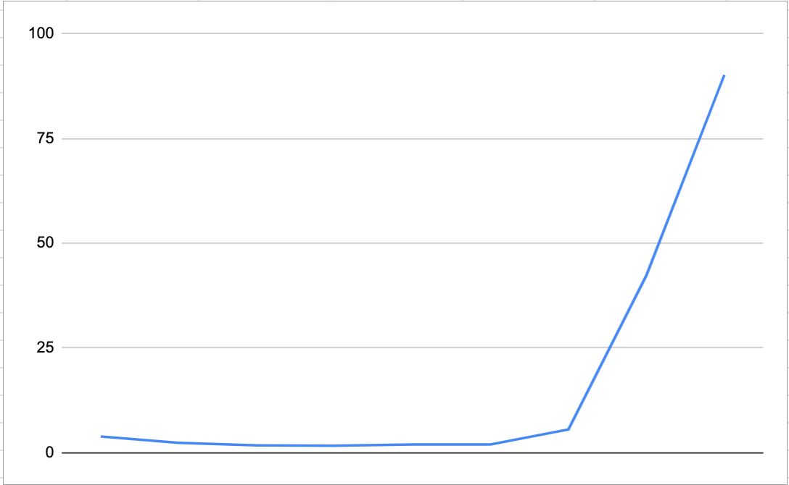

## Комп'ютерні системи імітаційного моделювання
## СПм-22-5, **Вінтонович Микита Сергійович**
### Лабораторна робота №**1**. Опис імітаційних моделей та проведення обчислювальних експериментів

 

### Варіант 5, модель у середовищі NetLogo:
[Fire Extension](http://www.netlogoweb.org/launch#http://www.netlogoweb.org/assets/modelslib/IABM%20Textbook/chapter%203/Fire%20Extensions/Fire%20Simple%20Extension%202.nlogo)

 

### Вербальний опис моделі:
Симуляція поширення вогню в лісі. Це показує, що ймовірність охоплення вогню правого краю лісу критично залежить від щільності дерев.
Дана модель додає вітер, що збільшує ймовірність загоряння вогню за напрямком вітру, та зменшує у протилежному.

### Керуючі параметри:
- **density** - щільність дерев у лісі.
- **probability-of-spread** (імовірність поширення) впливає на те, як пожежа поширюється від ділянки до ділянки.
- **south-wind-speed** (швидкість південного вітру) впливає на те, наскільки сильний південний вітер.  (Негативне значення для північного вітру).
- **west-wind-speed** (швидкість західного вітру) впливає на те, наскільки сильний південний вітер. (Негативне значення для східного вітру).

### Внутрішні параметри:
- **initial-trees**. Кількість дерев.
- **direction**. Напрямок вітру.

### Показники роботи системи:
- процент втрачених дерев.
- напрямок та швидкість вітру.
- ймовірність загоряння дерев.

### Примітки:
При налаштуваннях керуючих параметрів, а саме, найвищої ймовірності загоряння дерев (100%) напрямок вітру майже не впливає на напрямок розповсюдження пожежі.

### Недоліки моделі:
Пожежа починається уздовж усієї лівої вертикальної лінії, а не з якоїсь конкретної точки зліва.

 

## Обчислювальні експерименти

### 1. Вплив щільності дерев на поширення вогню в лісі
Досліджується залежність втрачених дерев при винекнинні пожежі від щільності дерев на ділянці, протягом певної кількості тактів при встановлениї певних параметрів, зазначених на початку симуляції.
Експерименти проводяться при щільності від 10 до 90, з кроком 10, усього 9 симуляцій.  
Інші керуючі параметри мають значення за замовчуванням:
- **probability-of-spread**: 57%
- **south-wind-speed**: 25
- **west-wind-speed**: 25

<table>
<thead>
<tr><th>Щільність дерев</th><th>Процент втрат</th></tr>
</thead>
<tbody>
<tr><td>10</td><td>3,9</td></tr>
<tr><td>20</td><td>2,4</td></tr>
<tr><td>30</td><td>1,8</td></tr>
<tr><td>40</td><td>1,7</td></tr>
<tr><td>50</td><td>2,0</td></tr>
<tr><td>60</td><td>2,0</td></tr>
<tr><td>70</td><td>5,6</td></tr>
<tr><td>80</td><td>42,3</td></tr>
<tr><td>90</td><td>90,1</td></tr>
</tbody>
</table>

Інші керуючі параметри мають значення за замовчуванням:
- **probability-of-spread**: 67%
- **south-wind-speed**: 25
- **west-wind-speed**: 25

<table>
<thead>
<tr><th>Щільність дерев</th><th>Процент втрат</th></tr>
</thead>
<tbody>
<tr><td>10</td><td>4,4</td></tr>
<tr><td>20</td><td>2,4</td></tr>
<tr><td>30</td><td>1,9</td></tr>
<tr><td>40</td><td>1,8</td></tr>
<tr><td>50</td><td>2,1</td></tr>
<tr><td>60</td><td>3,8</td></tr>
<tr><td>70</td><td>21,3</td></tr>
<tr><td>80</td><td>90,3</td></tr>
<tr><td>90</td><td>98,5</td></tr>
</tbody>
</table>

Інші керуючі параметри мають значення за замовчуванням:
- **probability-of-spread**: 77%
- **south-wind-speed**: 25
- **west-wind-speed**: 25

<table>
<thead>
<tr><th>Щільність дерев</th><th>Процент втрат</th></tr>
</thead>
<tbody>
<tr><td>10</td><td>4,6</td></tr>
<tr><td>20</td><td>2,5</td></tr>
<tr><td>30</td><td>2,0</td></tr>
<tr><td>40</td><td>2,0</td></tr>
<tr><td>50</td><td>2,5</td></tr>
<tr><td>60</td><td>7,0</td></tr>
<tr><td>70</td><td>83,8</td></tr>
<tr><td>80</td><td>96,6</td></tr>
<tr><td>90</td><td>100,0</td></tr>
</tbody>
</table>

Графіки наочно показують, чим більша щільність дерев, тим більший відсоток їх втрати при пожежі
