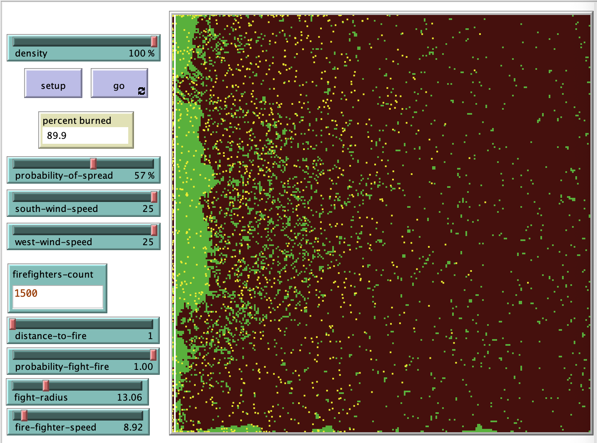

## Комп'ютерні системи імітаційного моделювання
## СПм-22-5, **Вінтонович Микита Сергійович**
### Лабораторна робота №**2**. Редагування імітаційних моделей у середовищі NetLogo

 

### Варіант 5, модель у середовищі NetLogo:
[Fire Extension](http://www.netlogoweb.org/launch#http://www.netlogoweb.org/assets/modelslib/IABM%20Textbook/chapter%203/Fire%20Extensions/Fire%20Simple%20Extension%202.nlogo)

 

### Внесені зміни у вихідну логіку моделі, на власний розсуд:

**Додано наступні глобальні змінні у setup:**.

fireFighters - кількість пожежників
fireFightersSteps - додаткова змінна для підрахування наступної позиціїї пожежників
fireFighterColor - колір пожежника
distanceToFire - початкова відстань до лінії вогню

<pre>
globals [
  initial-trees   ;; how many trees (green patches) we started with
  fireFighters
  fireFightersSteps
  fireFighterColor
  distanceToFire
]
</pre>

**Додано процедуру додавання пожежників перед початком симуляції:**.

<pre>
to makeAgents

  set fireFighters firefighters-count

  ask patches with [pxcor = min-pxcor + distanceToFire and pcolor = black] [
    if fireFighters > 0 [
      set pcolor fireFighterColor
    ]

    set fireFighters fireFighters - 1
  ]

end
</pre>

**Додано процедуру переміщення пожежників під час симуляції:**.

<pre>
to moveAgents

  set fireFighters firefighters-count
  set fireFightersSteps fireFightersSteps + 1

  ask patches with [pxcor = min-pxcor + distanceToFire + fireFightersSteps and (pcolor = black or pcolor = green)] [
    if fireFighters > 0 [
      set pcolor fireFighterColor
    ]

    set fireFighters fireFighters - 1
  ]
end
</pre>

**Додано процедуру боротьби пожежників з вогнем під час симуляції:**.

<pre>
to fightWithFire

  ask patches with [ pxcor = min-pxcor + distanceToFire + fireFightersSteps and pcolor = fireFighterColor ] [
       ask neighbors4 with [ pcolor = red ] [
         set pcolor blue + 2
       ]
    ]

end
</pre>

Фінальний код моделі та її інтерфейс доступні за [посиланням](Project/Fire Simple Extension 2.nlogo).
