## Комп'ютерні системи імітаційного моделювання
## СПм-22-5, **Вінтонович Микита Сергійович**
### Лабораторна робота №**3**. Редагування імітаційних моделей у середовищі NetLogo

 

### Варіант 5, модель у середовищі NetLogo:
[Fire Extension](http://www.netlogoweb.org/launch#http://www.netlogoweb.org/assets/modelslib/IABM%20Textbook/chapter%203/Fire%20Extensions/Fire%20Simple%20Extension%202.nlogo)

 

### Внесені зміни у вихідну логіку моделі, на власний розсуд:

### Вербальний опис моделі:
Симуляція поширення вогню в лісі. Це показує, що ймовірність охоплення вогню правого краю лісу критично залежить від щільності дерев.
Дана модель додає вітер, що збільшує ймовірність загоряння вогню за напрямком вітру, та зменшує у протилежному.

### Керуючі параметри:
- **density** - щільність дерев у лісі.
- **probability-of-spread** (імовірність поширення) впливає на те, як пожежа поширюється від ділянки до ділянки.
- **south-wind-speed** (швидкість південного вітру) впливає на те, наскільки сильний південний вітер.  (Негативне значення для північного вітру).
- **west-wind-speed** (швидкість західного вітру) впливає на те, наскільки сильний південний вітер. (Негативне значення для східного вітру).

### Внутрішні параметри:
- **initial-trees**. Кількість дерев.
- **direction**. Напрямок вітру.

### Показники роботи системи:
- процент втрачених дерев.
- напрямок та швидкість вітру.
- ймовірність загоряння дерев.

### Примітки:
При налаштуваннях керуючих параметрів, а саме, найвищої ймовірності загоряння дерев (100%) напрямок вітру майже не впливає на напрямок розповсюдження пожежі.

### Недоліки моделі:
Пожежа починається уздовж усієї лівої вертикальної лінії, а не з якоїсь конкретної точки зліва.

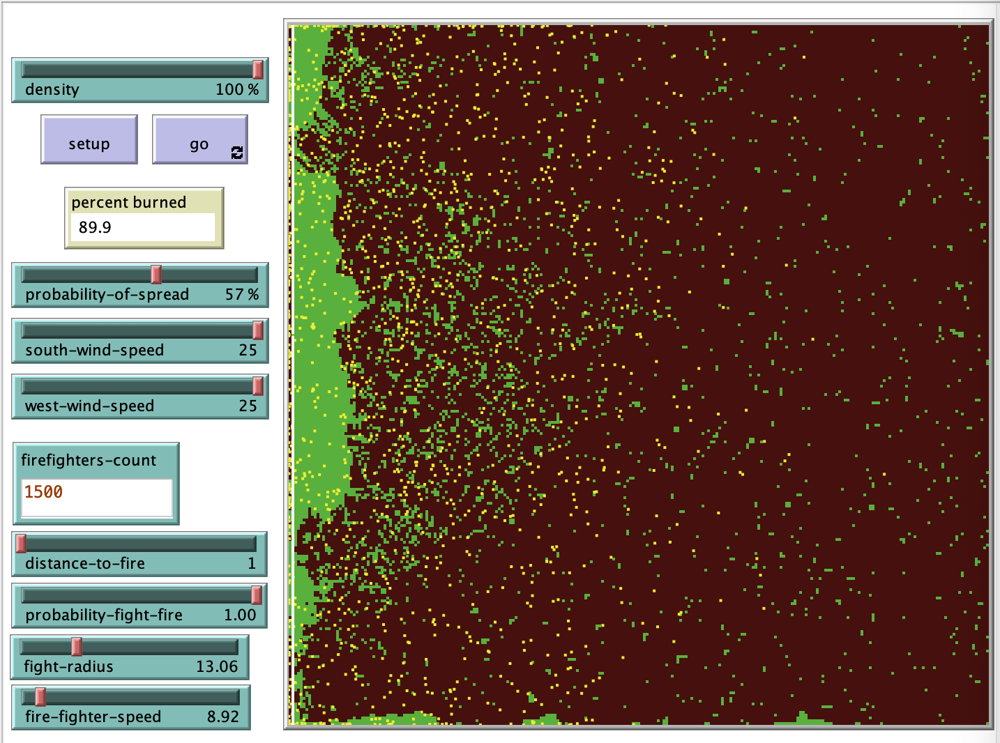

### Параметри моделі:
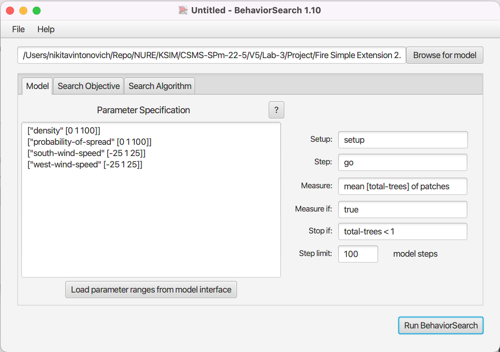

### Налаштування цільової функції (вкладка Search Objective):
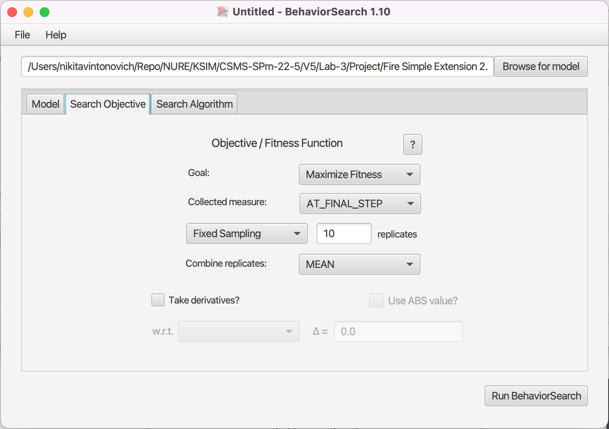

### Налаштування алгоритму пошуку (вкладка Search Algorithm):
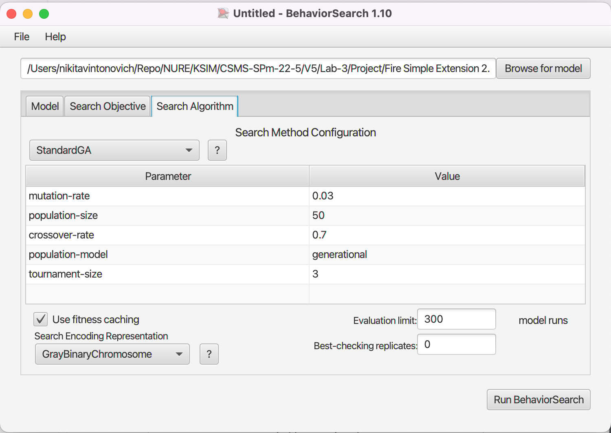

### Результати використання BehaviorSearch. Генетичний алгоритм:
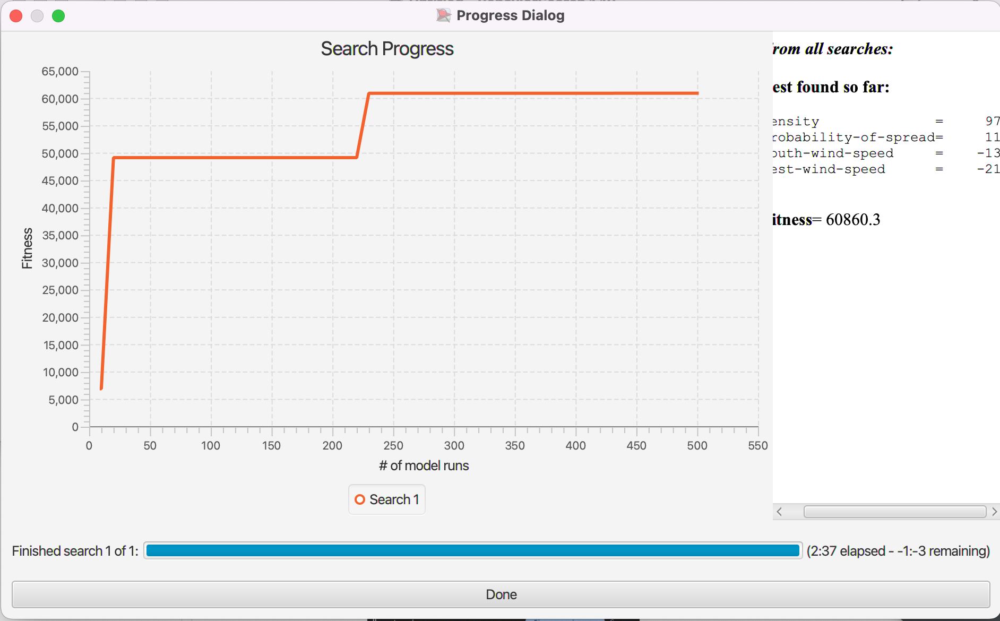

### Результати використання BehaviorSearch. Випадковий пошук:
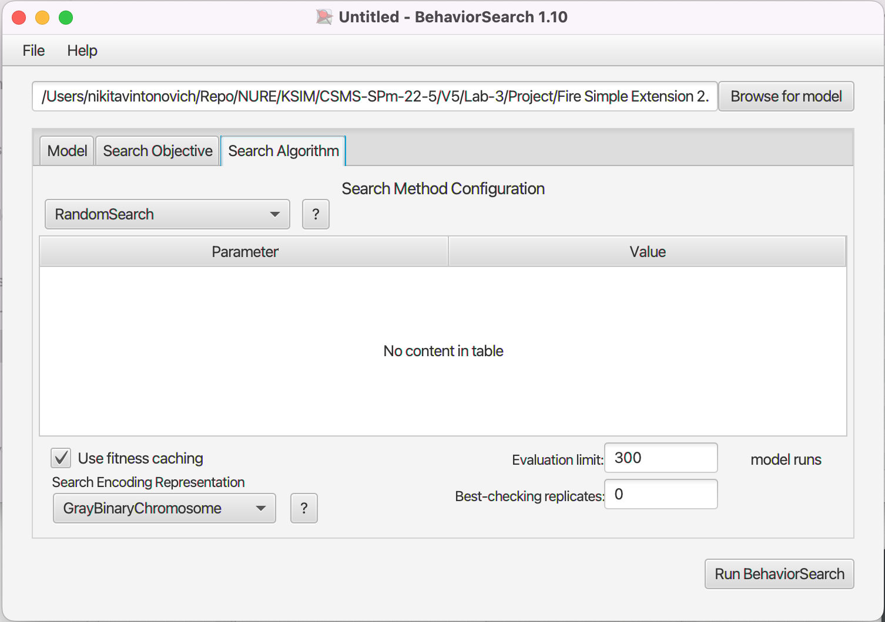
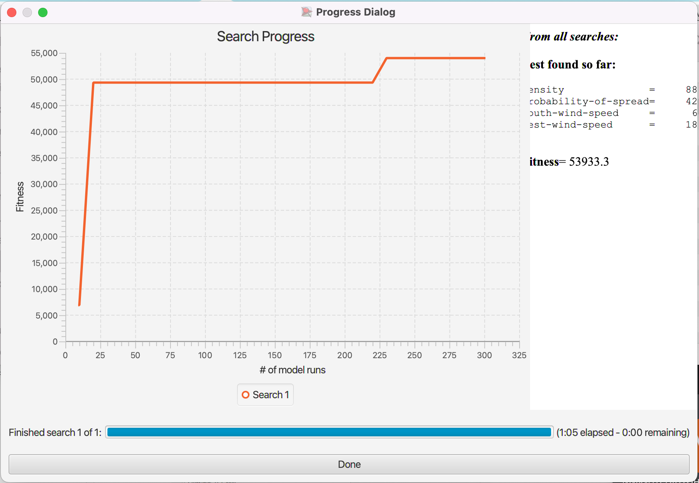

### Результати використання BehaviorSearch. Алгоритм імітації відпалу:
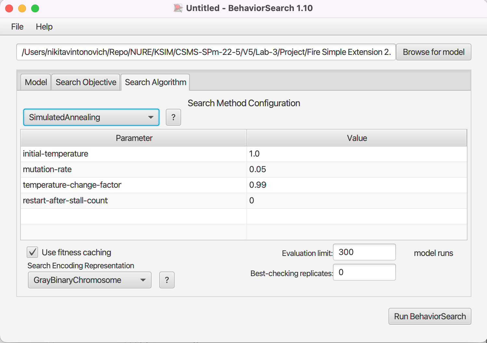
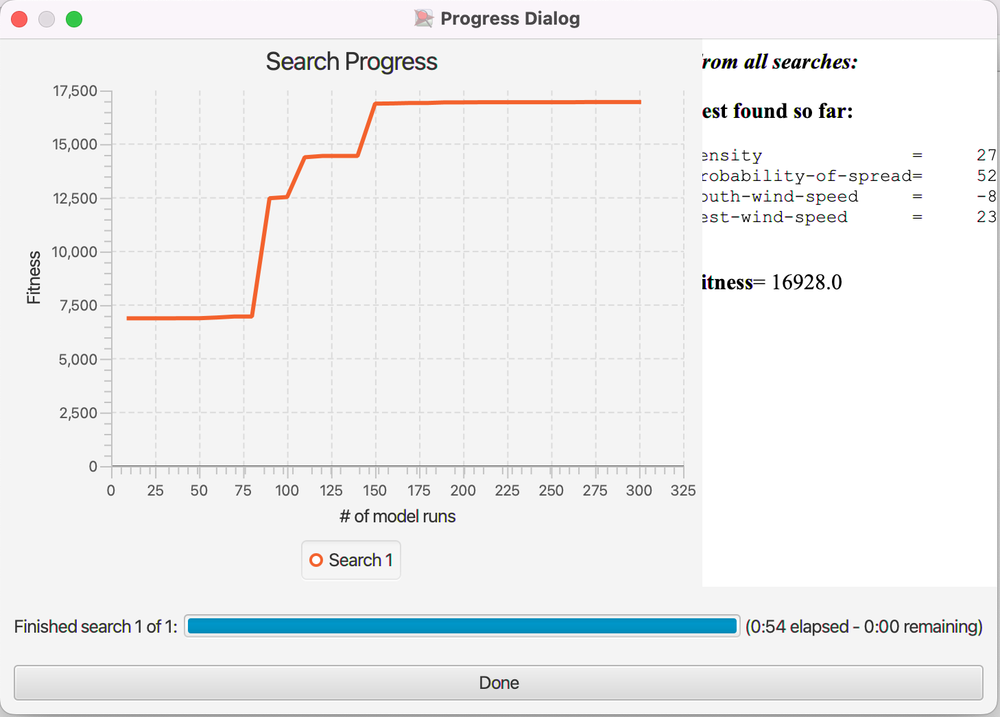

### Результати використання BehaviorSearch. Mutation hill-climber:
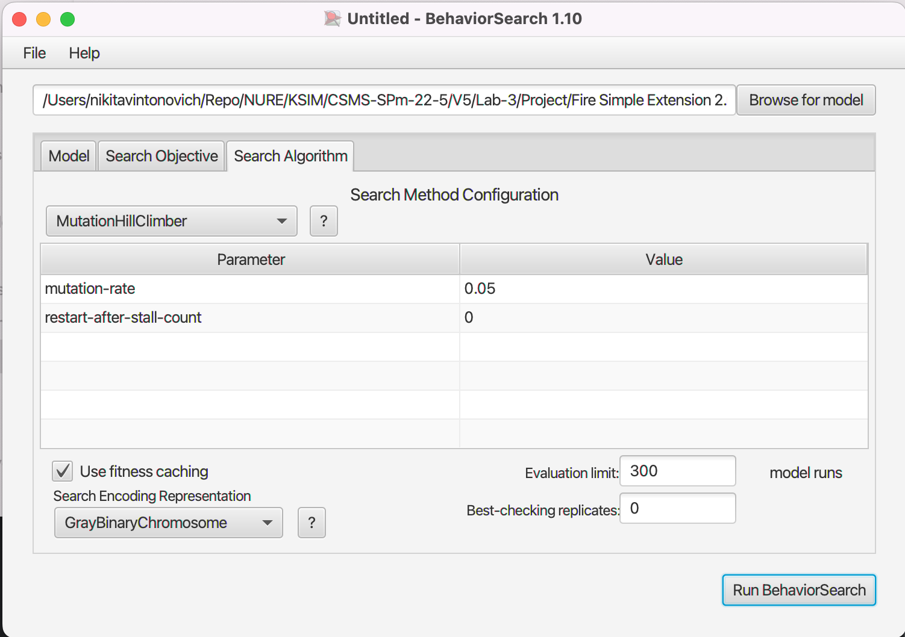
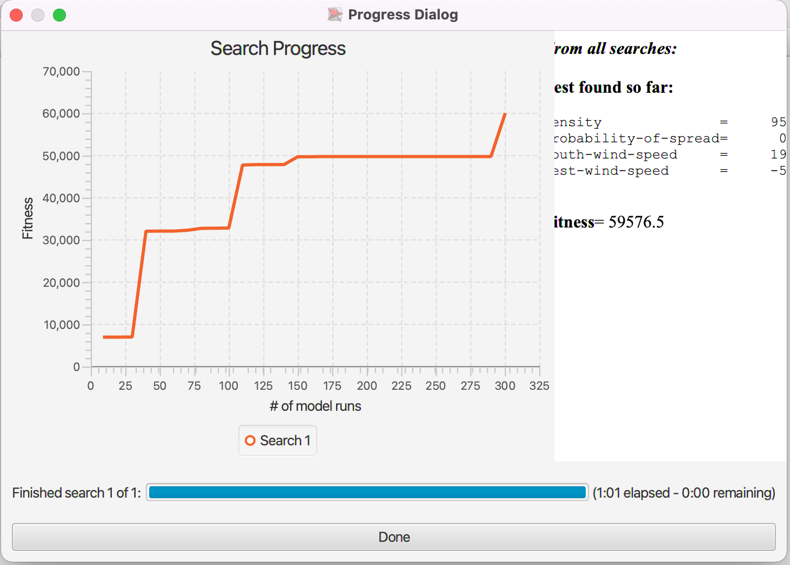

Фінальний код моделі та її інтерфейс доступні за .
